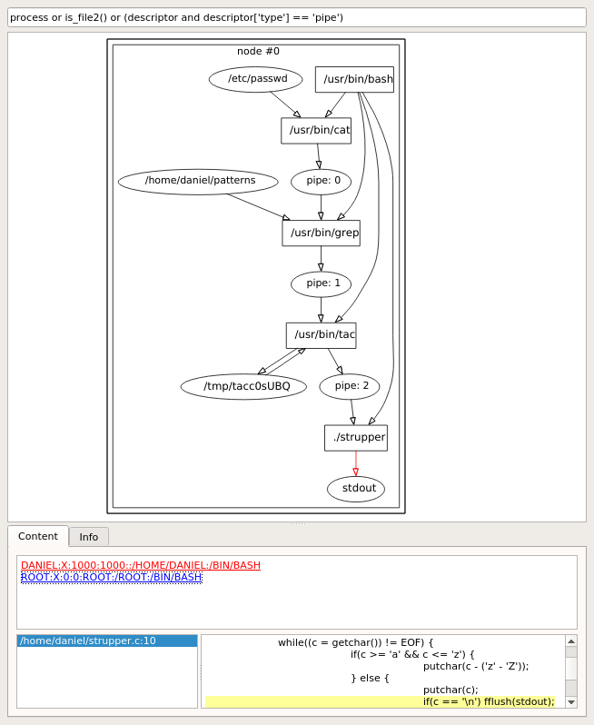
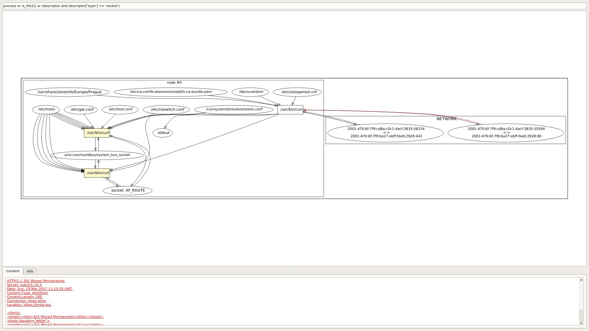
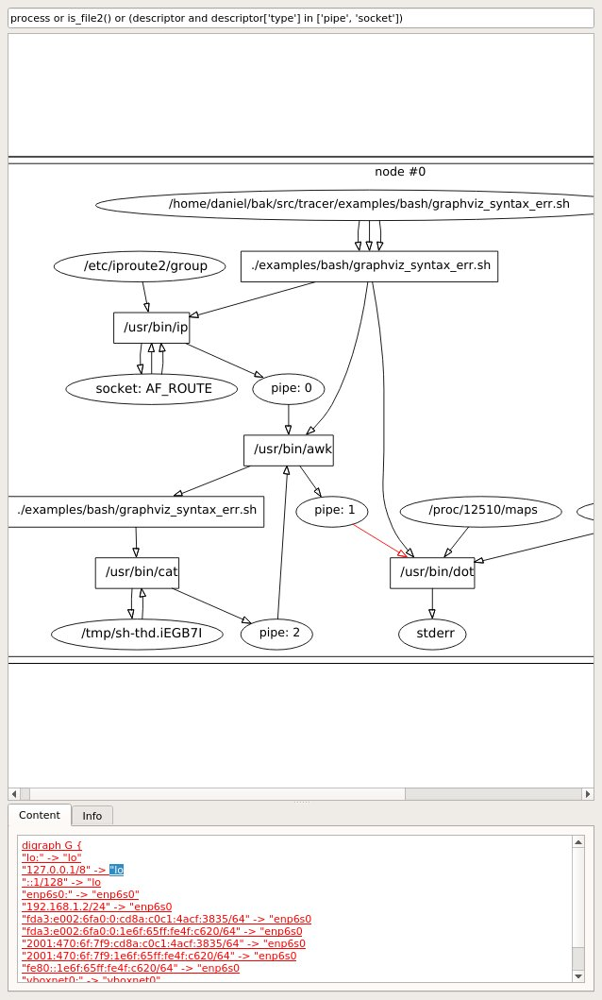

========
Examples
========

    An example of application that uses pipes for communication.
    Content tab shows data that has been read or written.
    Each corresponding syscall has own color and when backtrace is enabled (-b option) then it shows backtrace.

    An example of application that sends HTTP request to server.
    Server then redirects user to https version.

    Bash `script creating graph of network interfaces and ip addresses <https://github.com/trnila/tracer/blob/master/examples/bash/graphviz_syntax_err.sh>`_, but unfortunately there is syntax error in DOT language.
    What graph data are sent to graphviz?
    There is no need of modifying bash script to see corrupted graph data.
