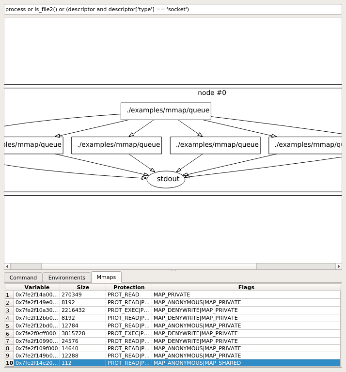
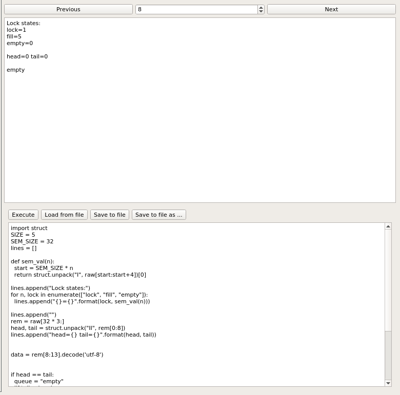

====
mmap
====
Basic inexpensive information about mmaps are written by default. 
This informations just shows address, size, protection and flags.
Additional you can enable tracking pages or tracking whole content.

Tracking pages
==============
By invoking tracer with ``--trace-mmap`` option, tracer will collect pages of file-backed mmaps that are accessed and thus available in memory.
This can be used for roughly estimates about which regions of mapped files are accessed.

Capture content
===============
When you invoke tracer with ``--save-mmap`` option, tracer will capture all mapped regions each time they change.
It could be used for IPC inspection that uses shared mmap.

Captured regions could be also filtered by adding function *mmap_filter* to your configuration file.
Function requires argument of instance *RegionCapture*. 
Fom this instance, you can access process and decide more complex conditions.

The following example allows capturing file-backed region with file */tmp/file* that is mapped in binary ending with *write_track*.
This region will capture only 8192 bytes from offset 6000.
Regions with size of 128 are immediatelly ignored.
The last row ignores regions that are file-backed.

.. code-block:: python

    def mmap_filter(region):
        if region.descriptor and region.descriptor['path'] == '/tmp/file' and region.process['executable'].endswith('write_track'):
            return {
                'size': 8182,
                'offset': 6000
            }

        if region.size == 128:
            return False

    return not region.descriptor

   An example report for `producer consumer <https://github.com/trnila/tracer/blob/master/examples/mmap/queue.c>`_.

   Mmap captured content. User is for example able to view hex representation in external editor by right clicking on upper half.
   Custom scripts can be used to parse mmaped region and show only relevant information.
   Input of that script is **raw** of type bytes and output data have to be set in **result** variable.
   Example on this image shows states of semaphores, value of head, tail and current letters in queue.
